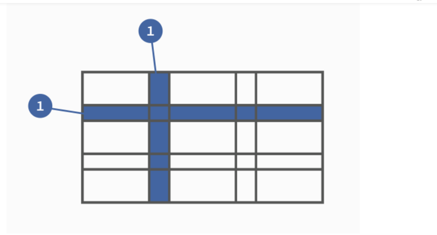

### CSS Grid 网格布局

#### 什么是grid布局

  >Grid 译为网格的意思，故 Grid 布局中文唤为网格布局，它是众多网页布局中的一种可选方案。它可以将网页划分成一个个网格，而且可以任意组合不同的网格以达到各种各样的布局，不需要通过复杂的 CSS 样式就可以实现复杂的网页布局。 

### 基本概念

1. ##### **容器（container）和 项目（item）**

    **容器（container）：**确定网格布局的区域，最外层的元素就是容器。
   **项目（item）**：容器下的第一代子元素就是项目，项目里面的子元素不包括在内。

   ```html
   <div class="container">
       <span class="item">1</span>
       <span class="item">2</span>
       <span class="item">3</span>
   </div>
   ```

   >  采用 Grid 布局的区域，我们称之为“容器”，容器内部采用网格定位的子元素称之为“项目”。我们来看下面一段 html结构，下面这段代码中类名为 container 的 div 就可以视为容器，内部三个 span 元素视为项目。

2. ##### 行和列

   >   容器里面的水平区域称为"行"（row），垂直区域称为"列"（column） 

   

3. #####  网格线和单元格

   **单元格（cell）：**行和列的交叉区域就叫做单元格。正常情况下，n行和m列会产生 n x m 个单元格。
    **网格线（grid line）：**划分网格的线叫做网格线，水平网格线划分出行，垂直网格线划分出列。正常情况下，n 行有 n + 1 根水平网格线，m 列有 m + 1 根垂直网格线。

#### Grid 布局属性

1. ##### display:grid

2. ##### grid-template-columns 属性，grid-template-rows 属性

3. ##### grid-row-gap 属性，grid-column-gap 属性，grid-gap 属性

4. #####  grid-template-areas 属性

5. ##### grid-auto-flow: row | column | row dense | column dense 属性

6. #####  justify-items、align-items、place-items 属性

