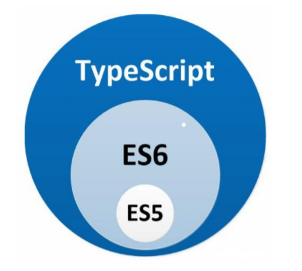

# TypeScript

## 简介

 TypeScript 是 Javascript 的超集，遵循最新的 ES6、ES5 规范，TypeScript 扩展了 JavaScript 的语法 ，对类型进行了约束，限制。

**ts 的优势**

1. **支持类型检查，编译时运行，减少bug,类型错误**
2. **语法提示**
3. **方便代码重构**

三者之间的关系

  

## 下载安装

```sh
npm install -g typescript  全局安装
tsc -v     查看版本
tsc xxx.ts   生成js文件
node xxx.js  运行js文件
```

## TypeScript 类型

TypeScript 的核心原则之一是对值所具有的结构进行类型检查。它通常不考虑值是从何处得到的，只要值的结构符合类型要求即可。

#### 1. 基础类型

##### 1.1 原始类型
TypeScript 的原始类型包括以下几种：

- **`number`**：表示数字，包括整数和浮点数。
  ```typescript
  let num: number = 123;
  ```

- **`string`**：表示文本数据。
  ```typescript
  let str: string = "Hello, TypeScript!";
  ```

- **`boolean`**：表示逻辑实体，值为 `true` 或 `false`。
  ```typescript
  let isDone: boolean = false;
  ```

- **`null`**：表示空值。
  ```typescript
  let n: null = null;
  ```

- **`undefined`**：表示未定义的值。
  ```typescript
  let u: undefined = undefined;
  ```

- **`symbol`**：表示一个唯一的、不可变的数据类型。
  ```typescript
  let s: symbol = Symbol("id");
  ```

- **`bigint`**：表示大于 `2^53 - 1` 的整数。
  ```typescript
  let big: bigint = BigInt(1234567890123456789012345678901234567890n);
  ```

##### 1.2 数组类型
数组类型可以通过两种方式声明：

- 使用类型后跟一对方括号来表示数组。
  ```typescript
  let nums: number[] = [1, 2, 3];
  ```

- 使用数组泛型。
  ```typescript
  let strs: Array<string> = ["a", "b", "c"];
  ```

##### 1.3 元组类型
元组类型允许表示一个已知元素数量和类型的数组，各元素的类型不必相同。

- 元组类型可以使用解构赋值。
  ```typescript
  let x: [string, number];
  x = ["hello", 10];
  ```

- 元组类型可以使用 `...` 表示剩余元素。
  ```typescript
  let y: [string, number, ...boolean[]];
  y = ["hello", 10, true, false];
  ```

- 元组类型可以使用 `readonly` 表示只读元素。
  ```typescript
  let z: readonly [string, number];
  z = ["hello", 10];
  // z[0] = "world"; // Error: Cannot assign to 'z' because it is a read-only tuple type.
  ```

##### 1.4 枚举类型
枚举类型是 TypeScript 中的一种特殊的数据类型，它允许一组命名的常量。

- 定义枚举类型：
  ```typescript
  enum Direction {
    Up = 1,
    Down,
    Left,
    Right
  }
  ```

- 使用枚举类型：
  ```typescript
  let direction: Direction = Direction.Up;
  console.log(direction); // 输出 1
  ```

##### 1.5 `any` 类型
`any` 类型表示任意数据类型，可以赋值为任意类型。

- 使用 `any` 类型：
  ```typescript
  let notSure: any = 4;
  notSure = "maybe a string instead";
  notSure = false; // okay, definitely a boolean
  ```

##### 1.6 `unknown` 类型
`unknown` 类型是 `any` 类型的严格版本，表示一个未知的类型。在使用 `unknown` 类型的值之前，必须先进行类型检查。

- 使用 `unknown` 类型：
  ```typescript
  let value: unknown;
  value = 42;
  value = "Hello";
  value = true;

  if (typeof value === "string") {
    console.log(value.toUpperCase());
  }
  ```

##### 1.7 `void` 类型
`void` 类型表示没有任何类型，通常用于函数返回值类型。

- 使用 `void` 类型：
  ```typescript
  function warnUser(): void {
    console.log("This is my warning message");
  }
  ```

##### 1.8 `never` 类型
`never` 类型表示那些永不存在的值的类型，通常用于函数返回值类型。

- 使用 `never` 类型：
  ```typescript
  function error(message: string): never {
    throw new Error(message);
  }
  ```

##### 1.9 联合类型
联合类型表示一个值可以是几种类型之一。

- 使用联合类型：
  ```typescript
  let x: string | number;
  x = "hello";
  x = 10;
  ```

##### 1.10 类型别名
类型别名通过 `type` 关键字定义一个新的类型。

- 使用类型别名：
  ```typescript
  type Point = {
    x: number;
    y: number;
  };

  let point: Point = { x: 10, y: 20 };
  ```

##### 1.11 类型断言
类型断言可以用来手动指定一个值的类型。

- 使用类型断言：
  ```typescript
  let someValue: any = "this is a string";
  let strLength: number = (someValue as string).length;
  ```

#### 2. 高级类型

##### 2.1 交叉类型
交叉类型是将多个类型合并为一个类型。

- 使用交叉类型：
  ```typescript
  type PartA = { a: number };
  type PartB = { b: string };
  type Combined = PartA & PartB;

  let combined: Combined = { a: 10, b: "hello" };
  ```

##### 2.2 类型保护
类型保护是一种在代码中检查一个联合类型的值到底属于哪种类型的方法。

- 使用类型保护：
  ```typescript
  function padLeft(value: string, padding: string | number) {
    if (typeof padding === "number") {
      return Array(padding + 1).join(" ") + value;
    }
    if (typeof padding === "string") {
      return padding + value;
    }
    throw new Error(`Expected string or number, got ${padding}`);
  }
  ```

##### 2.3 类型守卫
类型守卫是一种特殊的类型保护，它通过一个函数来判断一个值是否属于某种类型。

- 使用类型守卫：
  ```typescript
  function isNumber(x: any): x is number {
    return typeof x === "number";
  }

  function isString(x: any): x is string {
    return typeof x === "string";
  }

  function padLeft(value: string, padding: string | number) {
    if (isNumber(padding)) {
      return Array(padding + 1).join(" ") + value;
    }
    if (isString(padding)) {
      return padding + value;
    }
    throw new Error(`Expected string or number, got ${padding}`);
  }
  ```

##### 2.4 条件类型
条件类型是一种基于条件的类型选择。

- 使用条件类型：
  ```typescript
  type If<C, T, F> = C extends true ? T : F;
  type TrueResult = If<true, "yes", "no">; // "yes"
  type FalseResult = If<false, "yes", "no">; // "no"
  ```

##### 2.5 映射类型
映射类型是一种通过一个类型来生成一个新的类型。

- 使用映射类型：
  ```typescript
  type OptionsFlags<Type> = {
    [Property in keyof Type]: boolean;
  };

  type FeatureFlags = {
    darkMode: () => void;
    newUserProfile: () => void;
  };

  type FeatureOptions = OptionsFlags<FeatureFlags>; // { darkMode: boolean; newUserProfile: boolean; }
  ```

##### 2.6 索引类型
索引类型是一种通过索引访问对象属性的类型。

- 使用索引类型：
  ```typescript
  type ArrayOfNumbers = number[];
  type SecondItem<T> = T[1];

  let myArray: ArrayOfNumbers = [1, 2, 3];
  let secondItem: SecondItem<ArrayOfNumbers> = myArray[1];
  ```

##### 2.7 类型查询
类型查询是一种通过已有的类型来查询新的类型。

- 使用类型查询：
  ```typescript
  type FunctionType = () => void;
  type TypeOfReturnType = ReturnType<FunctionType>; // void
  ```

##### 2.8 类型推断
类型推断是 TypeScript 的一个重要特性，它允许 TypeScript 在没有显式指定类型的情况下推断出变量的类型。

- 使用类型推断：
  ```typescript
  let x = 3;
  // TypeScript 推断 x 的类型为 number
  ```
好的，接下来继续补充 **TypeScript 类型** 相关的内容，重点介绍一些高级类型以及类型系统的高级用法。

### TypeScript 类型（续）

#### 3. 类型的高级用法

##### 3.1 类型兼容性
TypeScript 的类型兼容性基于结构化类型系统，即类型是否兼容取决于它们的结构，而不是它们的名称。

- **结构化类型系统**
  ```typescript
  interface Named {
    name: string;
  }

  interface Person {
    name: string;
    age: number;
  }

  let p: Person = { name: "Alice", age: 20 };
  let n: Named = p; // OK，因为 p 的结构兼容 Named
  ```

- **函数类型兼容性**
  函数类型的兼容性取决于参数类型和返回值类型。TypeScript 会检查参数类型是否兼容，并且返回值类型是否兼容。
  ```typescript
  function foo(x: number): number {
    return x;
  }

  function bar(x: number): string {
    return x.toString();
  }

  let f: () => number = foo; // OK，参数类型和返回值类型都兼容
  // let g: () => number = bar; // Error，返回值类型不兼容
  ```

##### 3.2 类型断言
类型断言是一种手动指定值的类型的方式，通常用于告诉 TypeScript 编译器某个值的实际类型。

- **类型断言的两种方式**
  ```typescript
  let someValue: any = "this is a string";
  let strLength: number = (someValue as string).length; // 使用 as 关键字
  let strLength2: number = <string>someValue.length; // 使用尖括号
  ```

- **类型断言的注意事项**
  类型断言并不会改变值的实际类型，它只是告诉 TypeScript 编译器如何理解这个值的类型。
  ```typescript
  let someValue: any = 123;
  let strLength: number = (someValue as string).length; // 运行时会报错，因为 someValue 实际上是 number
  ```

##### 3.3 类型别名（`type`）
类型别名可以通过 `type` 关键字定义一个新的类型，通常用于简化复杂的类型声明。

- **定义类型别名**
  ```typescript
  type Point = {
    x: number;
    y: number;
  };

  let point: Point = { x: 10, y: 20 };
  ```

- **联合类型与类型别名**
  ```typescript
  type StringOrNumber = string | number;
  let value: StringOrNumber = "hello";
  value = 123;
  ```

##### 3.4 接口（`interface`）
接口是 TypeScript 中定义对象结构的一种方式，它可以通过 `extends` 关键字实现继承。

- **定义接口**
  ```typescript
  interface Person {
    name: string;
    age: number;
  }

  let person: Person = { name: "Alice", age: 20 };
  ```

- **接口的继承**
  ```typescript
  interface Named {
    name: string;
  }

  interface Person extends Named {
    age: number;
  }

  let person: Person = { name: "Alice", age: 20 };
  ```

##### 3.5 泛型
泛型是一种强大的类型系统功能，允许你在定义函数、接口或类时，指定一个或多个类型参数。

- **泛型函数**
  ```typescript
  function identity<T>(arg: T): T {
    return arg;
  }

  let output = identity<string>("myString"); // 类型为 string
  ```

- **泛型接口**
  ```typescript
  interface GenericIdentityFn<T> {
    (arg: T): T;
  }

  let myIdentity: GenericIdentityFn<number> = identity;
  ```

- **泛型类**
  ```typescript
  class GenericNumber<T> {
    zeroValue: T;
    add: (x: T, y: T) => T;
  }

  let myGenericNumber = new GenericNumber<number>();
  myGenericNumber.zeroValue = 0;
  myGenericNumber.add = function (x, y) {
    return x + y;
  };
  ```

##### 3.6 类型查询（`typeof` 和 `keyof`）
类型查询允许你通过已有的值或类型来查询新的类型。

- **`typeof` 类型查询**
  ```typescript
  let x = "hello";
  type TypeOfX = typeof x; // TypeOfX 的类型是 "string"
  ```

- **`keyof` 类型查询**
  ```typescript
  type Point = { x: number; y: number };
  type P = keyof Point; // P 的类型是 "x" | "y"
  ```

##### 3.7 条件类型
条件类型允许你根据条件动态地选择类型。

- **基本条件类型**
  ```typescript
  type IsNumber<T> = T extends number ? true : false;
  type IsNumberResult = IsNumber<42>; // true
  type IsNotNumberResult = IsNumber<string>; // false
  ```

- **高级条件类型**
  ```typescript
  type If<C, T, F> = C extends true ? T : F;
  type TrueResult = If<true, "yes", "no">; // "yes"
  type FalseResult = If<false, "yes", "no">; // "no"
  ```

##### 3.8 映射类型
映射类型允许你通过一个类型来生成一个新的类型。

- **基本映射类型**
  ```typescript
  type OptionsFlags<Type> = {
    [Property in keyof Type]: boolean;
  };

  type FeatureFlags = {
    darkMode: () => void;
    newUserProfile: () => void;
  };

  type FeatureOptions = OptionsFlags<FeatureFlags>; // { darkMode: boolean; newUserProfile: boolean; }
  ```

- **高级映射类型**
  ```typescript
  type OptionsFlags<Type> = {
    [Property in keyof Type as `is${Capitalize<string & Property>}`]: boolean;
  };

  type FeatureFlags = {
    darkMode: () => void;
    newUserProfile: () => void;
  };

  type FeatureOptions = OptionsFlags<FeatureFlags>; // { isDarkMode: boolean; isNewUserProfile: boolean; }
  ```

##### 3.9 索引类型
索引类型允许你通过索引访问对象的属性。

- **基本索引类型**
  ```typescript
  type ArrayOfNumbers = number[];
  type SecondItem<T> = T[1];

  let myArray: ArrayOfNumbers = [1, 2, 3];
  let secondItem: SecondItem<ArrayOfNumbers> = myArray[1];
  ```

- **高级索引类型**
  ```typescript
  type ArrayOfNumbers = number[];
  type FirstItem<T> = T extends (infer U)[] ? U : never;

  let myArray: ArrayOfNumbers = [1, 2, 3];
  type FirstItemType = FirstItem<ArrayOfNumbers>; // number
  ```

##### 3.10 类型推断
TypeScript 的类型推断系统会自动推断变量的类型，无需显式声明。

- **类型推断的基本用法**
  ```typescript
  let x = 3; // TypeScript 推断 x 的类型为 number
  ```

- **函数参数的类型推断**
  ```typescript
  function identity<T>(arg: T): T {
    return arg;
  }

  let output = identity("myString"); // TypeScript 推断 T 的类型为 string
  ```

#### 4. 总结
TypeScript 的类型系统非常强大，提供了丰富的类型定义和高级类型功能。通过合理使用这些类型功能，可以编写出更加健壮、可维护的代码。

#### 5. 参考资料
- [TypeScript 官方文档](https://www.typescriptlang.org/docs/)
- [TypeScript 中文文档](https://www.tslang.cn/docs/home.html)

---