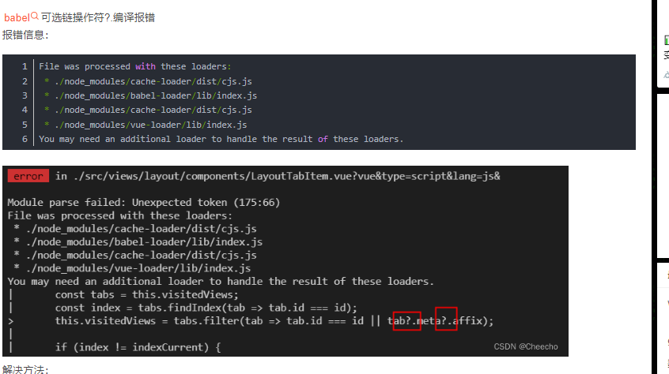

<!--
 * @Author: 吴莉蓉 wulr@eastcom-sw.com
 * @Date: 2025-07-17 16:42:29
 * @LastEditors: 吴莉蓉 wulr@eastcom-sw.com
 * @LastEditTime: 2025-07-18 11:28:09
 * @FilePath: \flr-blog\docs\posts\babel配置.md
 * @Description: 这是默认设置,请设置`customMade`, 打开koroFileHeader查看配置 进行设置: https://github.com/OBKoro1/koro1FileHeader/wiki/%E9%85%8D%E7%BD%AE
-->
---
title: babel配置
date: '2025-07-18'
category: 工具
tags: []
---
### Babel




```shell
npm install @babel/plugin-proposal-optional-chaining --save-dev

```

```js
在babel.config.js文件加配置
module.exports = {
  presets: ['@vue/app'],
  plugins: ["@babel/plugin-proposal-optional-chaining"]
}
```

Babel 是一个广泛使用的 JavaScript 编译器，用于将 ECMAScript 2015+ 代码转换为向后兼容的 JavaScript 版本，以便在不同环境中运行。以下是 Babel 的一些关键特点和用法：

1. **转译 ES6+ 代码：** Babel 可以将最新版本的 ECMAScript（ES6、ES7 等）代码转换为兼容性更好的 ES5 代码，以确保在不支持最新语法的环境中运行。

2. **插件系统：** Babel 的功能可以通过插件进行扩展和定制，使开发者可以根据项目需求选择特定的转换规则。

3. **预设（Presets）：** Babel 提供了预设（Presets），包含了一组相关的插件，可以快速设置常用的转换规则，如 @babel/preset-env 用于根据目标环境自动确定需要的转换。

4. **编译 JSX：** Babel 可以将 JSX 语法转换为普通的 JavaScript 代码，使得在不同框架中使用 JSX 成为可能。

5. **异步支持：** Babel 可以将 async/await 等异步代码转换为使用 Promise 或 Generator 的形式，以确保在不支持原生异步特性的环境中运行。

总的来说，Babel 是一个强大的工具，可以帮助开发者在现代 JavaScript 开发中保持代码的兼容性和可移植性。
