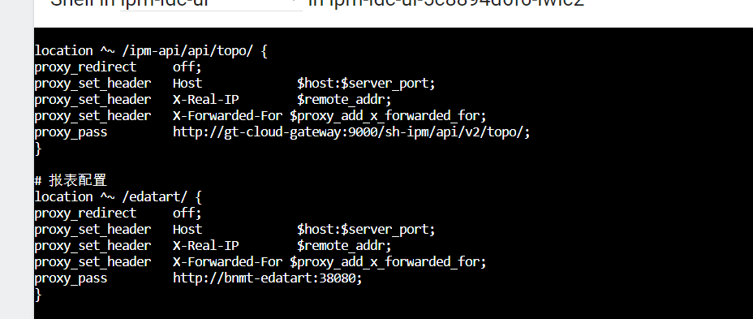

# iframe知识及其跨域问题

###  iframe标签

https://blog.csdn.net/weixin_44733660/article/details/117048195?ops_request_misc=%257B%2522request%255Fid%2522%253A%2522169424923016800185820005%2522%252C%2522scm%2522%253A%252220140713.130102334..%2522%257D&request_id=169424923016800185820005&biz_id=0&utm_medium=distribute.pc_search_result.none-task-blog-2~all~sobaiduend~default-2-117048195-null-null.142

1. iframe基本概念

   ```vue
   <iframe src='xxxx'/>
   ```

2. 属性介绍

   |属性|描述|
   |---|---|
   |allow |  允许特定功能的列表，如fullscreen，geolocation等|
   |allowfullscreen| 指定是否允许在iframe中使用全屏模式|
   |allowpaymentrequest| 指定是否允许在iframe中进行支付请求|
   |allowtransparency| 指定iframe是否可以是透明的|
   |class  |为iframe定义一个或多个类名|
   |frameborder| 指定是否在iframe周围显示边框|
   |height|  指定iframe的高度|
   |importance|指定iframe对页面内容的重要性|
   |loading| 指定iframe加载时的行为|
   |name|  为iframe定义一个名称|
   |referrerpolicy|指定如何发送referer HTTP标头|
   |sandbox| 启用iframe的沙盒模式，提高安全性|
   |src| **指定要在iframe中显示的文档的URL** |
   |srcdoc|在iframe中嵌入HTML代码而不是外部文档|
   |style  |定义iframe的CSS样式|
   |title| 为iframe定义一个标题|
   |width| 指定iframe的宽度|

3.  sandbox配置介绍

4.  在 iframe 中获取父级内容

- 获取上一级 window 对象
  通过 window.parent 获取上一级 window 对象（iframe 可以有多层使用）

- 获取最顶级容器的 window 对象
  通过 window.top 获取 window 对象（即打开页面时的文档）

- 返回自身 window 对象
  通过 window.self 返回自身 window 对象

  ```js
  window.parent //如果还是iframe则是该iframe的window对象
  window.top // 获取最顶级容器的window对象，即，就是你打开页面的文档
  window.self // 返回自身window的引用。可以理解 window===window.self
  ```

### 何为跨域

#####  跨域的原因：浏览器的同源策略

##### 什么是同源策略呢？

出于安全考虑，默认在网页中，使用JS发送请求，请求的服务器和当前所在网页的服务器必须一样，**即两个请求地址的 协议、域名、端口必须一致。**

Origin: &lt; scheme &gt; “/” &lt;host&gt; [ “:” &lt; port &gt; ],origin由用于访问它的URL的<strong>scheme（协议）、port（端口）、host（IP或域名</strong>）

```sh
协议相同  http https
域名相同  www.onlineclass.net
端口相同  80  81
```

在浏览器访问的时候，以上三者任意一个不同，都是跨域。

### 如何解决Iframe跨域

- 使用同源策略：将 iframe 的 src 属性设置为与父页面同源的 URL。这是最简单的解决方案，但限制较大，不适用于不同域的情况。
- **使用代理页面：在父页面的同域下创建一个代理页面，该页面与 iframe 的目标域同源，然后在代理页面中请求目标资源，并将请求结果传递回父页面。这样可以绕过跨域限制，但需要后端协助。**
- 跨文档消息（Cross-document Messaging）：使用 postMessage API，在父页面和 iframe 之间进行消息通信。这样可以安全地在不同域之间传递数据，但需要在父页面和 iframe 中编写消息监听和处理的逻辑。
- CORS（跨域资源共享）：如果你对服务器端有控制权，可以在服务器端设置 CORS 头，允许特定来源的页面访问资源。这是一种较为常用的跨域解决方案。
- JSONP（JSON with Padding）：如果目标资源是 JSON 数据，你可以通过 JSONP 的方式来获取数据，JSONP 是一种跨域请求数据的方法。
- **nginx配置代理：如果想在当前系统里嵌入其他系统链接，可以在nginx中，将请求的接口代理到对应的服务器下，实现接口的正常调用。**




