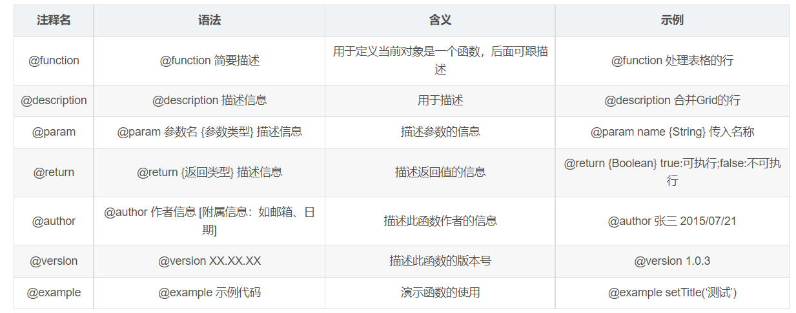

# Vuex 状态管理

Vuex 是一个专为 Vue.js 应用程序开发的状态管理模式 + 库。它采用集中式存储管理应用的所有组件的状态，并以相应的规则保证状态以一种可预测的方式发生变化。

Vuex 核心概念包括：State、Getter、Mutation、Action 和 Module



## State

> 提供唯一的公共数据源，所有共享的数据统一放到 Store 的 State 中进行存储，类似于组件中的 data。

### 基本用法

**创建 Store（Vuex 4.x 语法）：**
```javascript
import { createStore } from 'vuex'

export default createStore({
  // 数据，相当于组件中的 data
  state: {
    count: 0,
    message: 'Hello Vuex'
  },
  // 计算属性，相当于组件中的 computed
  getters: {},
  // 方法，用于修改状态（同步操作）
  mutations: {},
  // 方法，用于处理异步操作
  actions: {},
  // 模块，用于分割复杂状态
  modules: {}
})
```

### 访问 State 数据

**方法一：直接访问**
```vue
<template>
  <div>
    <p>当前计数: {{ $store.state.count }}</p>
    <p>消息: {{ $store.state.message }}</p>
  </div>
</template>
```

**方法二：使用 mapState 辅助函数**
```javascript
import { mapState } from 'vuex'

export default {
  computed: {
    // 将 this.count 映射为 this.$store.state.count
    ...mapState(['count', 'message']),
    // 也可以使用对象形式进行重命名
    ...mapState({
      myCount: 'count',
      myMessage: state => state.message
    })
  }
}
```

## Mutation

> 更改 Vuex 的 Store 中的状态的唯一方法是提交 Mutation。Vuex 中的 Mutation 非常类似于事件：每个 Mutation 都有一个字符串的事件类型 (type) 和一个回调函数 (handler)。

### 基本用法

**定义 Mutation：**
```javascript
export default createStore({
  state: {
    count: 0
  },
  mutations: {
    // 增加计数
    increment(state) {
      state.count++
    },
    // 带参数的 mutation
    incrementBy(state, payload) {
      state.count += payload.amount
    }
  }
})
```

**提交 Mutation：**
```javascript
// 在组件中
methods: {
  handleIncrement() {
    // 提交 mutation
    this.$store.commit('increment')
    // 提交带参数的 mutation
    this.$store.commit('incrementBy', { amount: 5 })
    // 或者使用对象形式
    this.$store.commit({
      type: 'incrementBy',
      amount: 5
    })
  }
}
```

**使用 mapMutations 辅助函数：**
```javascript
import { mapMutations } from 'vuex'

export default {
  methods: {
    ...mapMutations(['increment', 'incrementBy']),
    // 重命名
    ...mapMutations({
      add: 'increment',
      addBy: 'incrementBy'
    })
  }
}
```

::: warning 注意
Mutation 必须是同步函数！
:::

## Action

> Action 类似于 Mutation，不同在于：
> - Action 可以包含任意异步操作
> - Action 通过提交 Mutation 来改变状态，而不是直接变更状态

### 基本用法

**定义 Action：**
```javascript
export default createStore({
  state: {
    count: 0
  },
  mutations: {
    increment(state) {
      state.count++
    }
  },
  actions: {
    // 异步增加计数
    incrementAsync(context) {
      setTimeout(() => {
        context.commit('increment')
      }, 1000)
    },
    // 带参数的 action
    incrementByAsync(context, payload) {
      setTimeout(() => {
        context.commit('incrementBy', payload)
      }, 1000)
    }
  }
})
```

**分发 Action：**
```javascript
// 在组件中
methods: {
  handleAsyncIncrement() {
    // 分发 action
    this.$store.dispatch('incrementAsync')
    // 分发带参数的 action
    this.$store.dispatch('incrementByAsync', { amount: 5 })
    // 或者使用对象形式
    this.$store.dispatch({
      type: 'incrementByAsync',
      amount: 5
    })
  }
}
```

**使用 mapActions 辅助函数：**
```javascript
import { mapActions } from 'vuex'

export default {
  methods: {
    ...mapActions(['incrementAsync', 'incrementByAsync']),
    // 重命名
    ...mapActions({
      asyncAdd: 'incrementAsync',
      asyncAddBy: 'incrementByAsync'
    })
  }
}
```

## Getter

> Getter 用于对 Store 中的数据进行加工处理形成新的数据，类似于组件中的 computed 属性。
> Getter 的返回值会根据它的依赖被缓存起来，且只有当它的依赖值发生了改变才会被重新计算。

### 基本用法

**定义 Getter：**
```javascript
export default createStore({
  state: {
    todos: [
      { id: 1, text: '学习 Vue', done: true },
      { id: 2, text: '学习 Vuex', done: false }
    ]
  },
  getters: {
    // 过滤已完成的任务
    doneTodos(state) {
      return state.todos.filter(todo => todo.done)
    },
    // 带参数的 getter
    getTodoById: (state) => (id) => {
      return state.todos.find(todo => todo.id === id)
    }
  }
})
```

**访问 Getter：**
```vue
<template>
  <div>
    <p>已完成任务数: {{ $store.getters.doneTodos.length }}</p>
    <p>任务 1: {{ $store.getters.getTodoById(1).text }}</p>
  </div>
</template>
```

**使用 mapGetters 辅助函数：**
```javascript
import { mapGetters } from 'vuex'

export default {
  computed: {
    ...mapGetters(['doneTodos', 'getTodoById']),
    // 重命名
    ...mapGetters({
      completedTodos: 'doneTodos',
      findTodo: 'getTodoById'
    })
  }
}
```

## Module

> 当应用变得非常复杂时，Store 对象就有可能变得相当臃肿。
> Vuex 允许我们将 Store 分割成模块（Module）。每个模块拥有自己的 State、Mutation、Action、Getter、甚至是嵌套子模块。

### 基本用法

**定义模块：**
```javascript
// store/modules/cart.js
export default {
  namespaced: true, // 开启命名空间
  state: {
    items: []
  },
  mutations: {
    addItem(state, item) {
      state.items.push(item)
    }
  },
  actions: {},
  getters: {}
}

// store/index.js
import { createStore } from 'vuex'
import cart from './modules/cart'
import user from './modules/user'

export default createStore({
  modules: {
    cart,
    user
  }
})
```

**访问模块状态：**
```javascript
// 直接访问
this.$store.state.cart.items

// 使用 mapState 访问
...mapState('cart', ['items'])

// 提交模块的 mutation
this.$store.commit('cart/addItem', product)

// 分发模块的 action
this.$store.dispatch('cart/addItemAsync', product)
```

::: tip 提示
开启命名空间后，访问模块内的 mutation、action、getter 都需要加上模块名称。
如果不开启命名空间，模块内的状态会被合并到全局状态中。
:::


